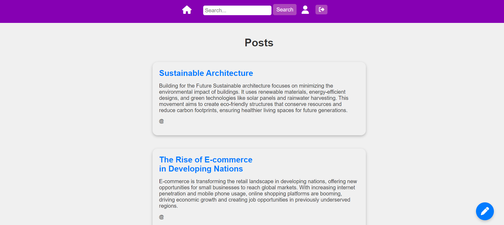

# Project Title

 <!-- Replace with your image path -->

## Description
A brief description of your project, what it does, and its purpose. This application is a web-based platform allowing users to create posts, view profiles, and search for content. It features user authentication using Firebase for secure sign-in and sign-out functionality.

## Table of Contents
- [Features](#features)
- [Technologies Used](#technologies-used)
- [Installation](#installation)
- [Usage](#usage)
- [Contributing](#contributing)
- [License](#license)

## Features
- User authentication with Firebase
- Create, view, and manage posts
- User profiles with personalized information
- Search functionality to filter posts

## Technologies Used
- **Frontend:**
  - React.js
  - React Router for navigation
  - Firebase for authentication
- **Styling:**
  - CSS for styling components

## Installation
To get started with the project, follow these steps:

1. **Clone the repository:**
   ```bash
   git clone https://github.com/yourusername/your-repo-name.git
   cd your-repo-name
